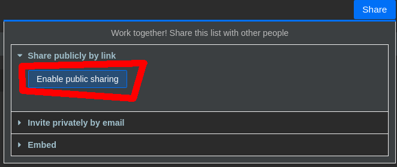
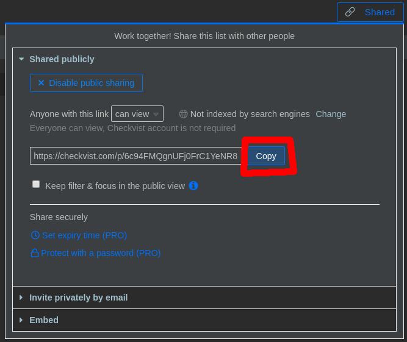

# checkvistsite

With checkvist site you can create a simple website from your public shared checkvist.com list.

## Get checkvist list url

You can get the public share link for you intended list via the checkvist website. Click on share and then select share public and copy the url:

1) Click on share public



2) Copy url




## Configure checkvistsite

In the `index.php` you can set your own share url as source for the site with the variable `$checkVistListURL`.

In the same file you can set the cache header time. This is required to not hit the checkvist api on every reload. This can be done with the variable `$everyXMin`

If you do prefer to use your own style over the predefined one, edit the css in `css/style.css`.

## Share styles

If you created a new styling for checkvistsite it would be nice if you could provide this to the community to help folks to get started with different styles easier.

Submit a pull request, or send me an email via checkvistsite@simon-frey.eu

## License

```
The MIT License (MIT)

Copyright (c) 2020 Simon Frey

Permission is hereby granted, free of charge, to any person obtaining a copy of
this software and associated documentation files (the "Software"), to deal in
the Software without restriction, including without limitation the rights to
use, copy, modify, merge, publish, distribute, sublicense, and/or sell copies of
the Software, and to permit persons to whom the Software is furnished to do so,
subject to the following conditions:

The above copyright notice and this permission notice shall be included in all
copies or substantial portions of the Software.

THE SOFTWARE IS PROVIDED "AS IS", WITHOUT WARRANTY OF ANY KIND, EXPRESS OR
IMPLIED, INCLUDING BUT NOT LIMITED TO THE WARRANTIES OF MERCHANTABILITY, FITNESS
FOR A PARTICULAR PURPOSE AND NONINFRINGEMENT. IN NO EVENT SHALL THE AUTHORS OR
COPYRIGHT HOLDERS BE LIABLE FOR ANY CLAIM, DAMAGES OR OTHER LIABILITY, WHETHER
IN AN ACTION OF CONTRACT, TORT OR OTHERWISE, ARISING FROM, OUT OF OR IN
CONNECTION WITH THE SOFTWARE OR THE USE OR OTHER DEALINGS IN THE SOFTWARE.```
